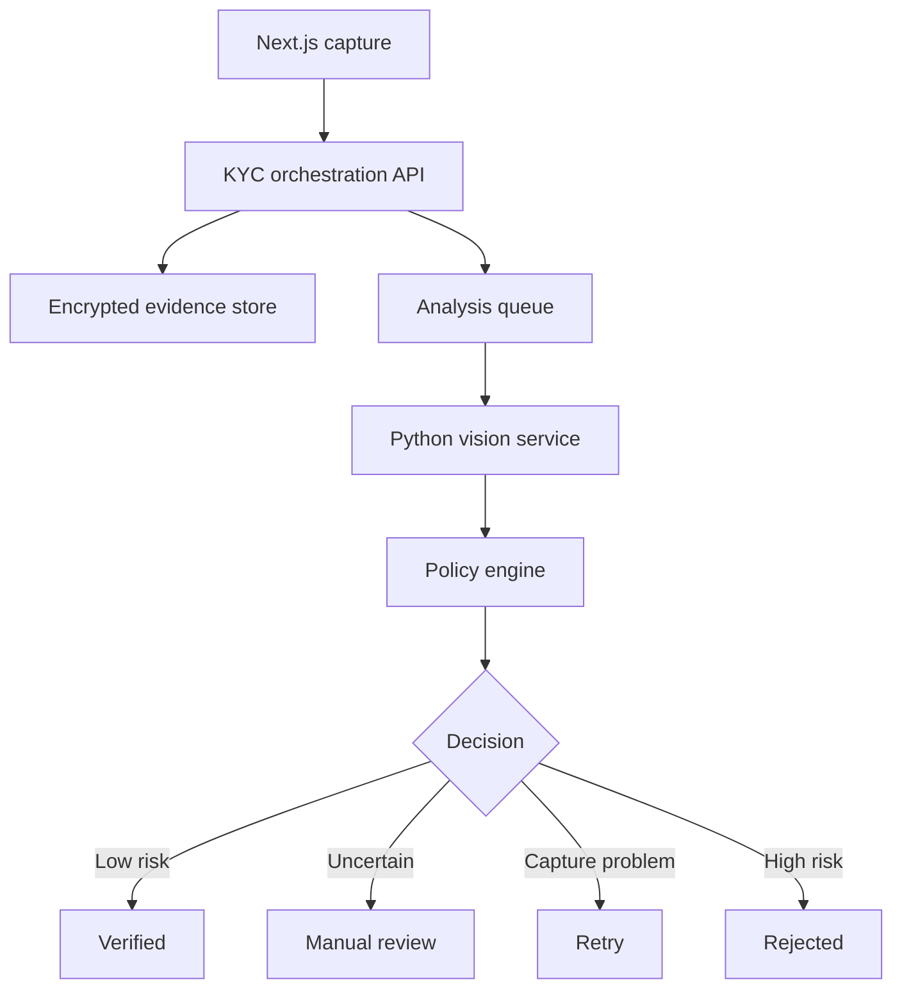

# DLKYC — Dialect Library Identity Verification Plan

**Document status:** Implementation plan  
**Product:** Dialect Library  
**Working name:** DLKYC  
**Primary purpose:** Trainer identity verification and payout-account protection  
**Frontend:** Next.js App Router, Tailwind CSS and Radix UI  
**AI providers available:** OpenAI, Anthropic and DeepSeek  

---

## 1. Executive Summary

DLKYC is a small, AI-assisted, self-hosted identity-verification service for Dialect Library. A trainer starts a verification session, scans or uploads an accepted identity document, records a short live selfie video and submits the session for automated analysis. The system extracts identity fields, checks the document, tests basic liveness, compares the document portrait with the selfie and either verifies the trainer or routes the case to an administrator.

The first release must be described as **identity verification**, not as a universal regulated KYC/AML provider. ID and face matching do not by themselves provide sanctions screening, politically exposed person screening, source-of-funds checks or every other control that may be required of a regulated financial service.

DLKYC should use deterministic, self-hosted computer-vision models for biometric decisions. OpenAI, Anthropic and DeepSeek may assist with document classification, OCR cleanup and reviewer explanations, but no general-purpose LLM may independently approve a user or calculate the authoritative face-match score.

---

## 2. Product Goals

### 2.1 Primary goals

- Confirm that a trainer controls a plausible, supported identity document.
- Extract the trainer's legal name, date of birth and relevant document fields.
- confirm that the live applicant resembles the portrait on the submitted document.
- Reduce duplicate, fraudulent and payout-abuse accounts.
- Automatically approve clear, low-risk cases.
- Send uncertain cases to a controlled manual-review queue.
- Preserve a complete, immutable decision and override history.
- Keep identity and biometric processing under Dialect Library's control.

### 2.2 Non-goals for the MVP

- Universal support for every identity document and country.
- Bank-grade or certified liveness detection.
- Guaranteed detection of every forged document or deepfake.
- Full AML, sanctions, PEP or adverse-media screening.
- Proof-of-address or source-of-funds verification.
- Training facial-recognition models from user submissions.
- Allowing an LLM to make the final verification decision.

---

## 3. Product Terminology

Use the following user-facing terminology:

- **Feature name:** DLKYC Identity Verification
- **Purpose statement:** Identity verification for trainer trust and payout-account protection
- **User result:** Verified, Under review, Retry required or Unsuccessful

Avoid claims such as "government certified," "bank-grade," "fraud-proof" or "complete KYC" unless the system is independently tested and legally authorised to make those claims.

---

## 4. Roles

### 4.1 Trainer

- Starts and completes a verification session.
- Gives informed acknowledgement before capture.
- Selects country and document type.
- Captures the identity document and selfie video.
- Reviews extracted details where permitted.
- Retries a failed-quality capture.
- Receives the final status without internal fraud signals.
- Can request human review of an adverse automated result.

### 4.2 KYC reviewer

- Reviews cases routed for manual intervention.
- Compares the submitted evidence with automated findings.
- Corrects OCR fields without altering the original extraction.
- Approves, rejects, requests a retry or escalates a case.
- Must enter a reason for every manual decision.

### 4.3 KYC administrator

- Configures supported countries and document types.
- Configures rules, retention periods and review permissions.
- Monitors quality, false-match and false-reject metrics.
- Publishes model and threshold versions.
- Cannot silently edit or erase audit records.

---

## 5. End-to-End User Journey

1. The authenticated trainer opens **Profile > Identity Verification**.
2. The system creates a short-lived KYC session bound to that user and device context.
3. The user receives a concise explanation of the purpose, data captured, retention period and review process.
4. The user acknowledges the biometric-processing notice.
5. The user selects issuing country and identity-document type.
6. The browser requests camera access and displays capture guidance.
7. The user captures or uploads the document front and, where required, the back.
8. Client-side checks detect low resolution, blur, glare, missing edges and excessive cropping.
9. The backend performs document classification, perspective correction, OCR and machine-readable-zone or barcode checks where supported.
10. The user confirms or corrects permitted extracted fields. Corrections are retained as user claims and do not overwrite original OCR output.
11. The user records a two-to-four-second live selfie video using a random instruction such as blink, turn left, turn right or follow a moving marker.
12. The biometric service selects high-quality frames, evaluates basic liveness and compares the live face with the document portrait.
13. The policy engine combines face, liveness, document, duplicate and session signals.
14. The result becomes `VERIFIED`, `MANUAL_REVIEW`, `RETRY_REQUIRED` or `REJECTED`.
15. A reviewer resolves uncertain cases, with a mandatory reason and audit record.
16. The Dialect Library account receives only the final verification status and minimum necessary identity attributes.

---

## 6. System Architecture

### 6.1 Components

| Component | Responsibility | Recommended technology |
|---|---|---|
| DL web application | Capture journey, status and reviewer UI | Next.js App Router, TypeScript, Tailwind CSS, Radix UI |
| KYC orchestration API | Sessions, authorisation, uploads, decisions and audit | Existing NestJS API or dedicated internal API |
| Vision service | OCR, face processing, quality and liveness inference | Python, FastAPI, OpenCV and ONNX Runtime |
| Background workers | CPU/GPU analysis outside web requests | RabbitMQ consumers or BullMQ workers |
| Relational store | Session metadata, fields, scores and audit events | PostgreSQL and Prisma |
| Evidence store | Encrypted document images and short selfie videos | Private S3-compatible object storage |
| Cache/locks | Session expiry, replay prevention and idempotency | Redis |
| Monitoring | Metrics, traces and operational alerts | Prometheus, Grafana and structured logs |

### 6.2 Logical flow



### 6.3 Deployment boundary

- Keep evidence storage private; never expose a permanent public URL.
- Use short-lived signed upload URLs and validate content after upload.
- Run the vision service on a private network accessible only by authorised workers.
- Separate biometric evidence from normal application data.
- Return derived findings to the application rather than returning raw embeddings.
- Support CPU inference initially; introduce a temporary GPU worker only if measured throughput requires it.

---

## 7. Capture Requirements

### 7.1 Document capture

- Guided frame overlay with visible document edges.
- Front and back steps based on document configuration.
- Camera capture preferred; file upload may be allowed by policy.
- Minimum resolution and maximum file-size enforcement.
- Supported formats limited to JPEG, PNG and HEIC after safe conversion.
- Server-side MIME inspection; never trust filename extensions.
- Automatic rotation and perspective correction.
- Immediate feedback for blur, glare, darkness, overexposure, cropping and obstruction.
- Explicit rejection of photocopies or screenshots when policy requires live capture.

### 7.2 Selfie capture

- Capture a two-to-four-second video burst, not only a still selfie.
- Require exactly one face.
- Randomise the active instruction.
- Keep the face inside an oval guide.
- Detect insufficient light, blur, occlusion and excessive distance.
- Select several high-quality frames for comparison.
- Reject frozen, repeated or discontinuous frame sequences.

### 7.3 Accessibility and recovery

- Provide written and spoken capture instructions.
- Support keyboard navigation and screen-reader labels.
- Provide an assisted/manual route when a user cannot complete biometric capture.
- Save only the stage/status, not partially submitted raw camera streams.
- Allow safe resumption before session expiry.

---

## 8. Document Analysis Pipeline

### 8.1 Pipeline stages

1. Validate file type, dimensions and size.
2. Strip unsafe metadata while preserving required forensic metadata separately.
3. Scan the upload for malicious content.
4. Detect document boundaries.
5. Correct rotation and perspective.
6. Calculate image-quality indicators.
7. Classify the document against supported templates.
8. Locate text regions and portrait region.
9. Run OCR.
10. Parse fields into a strict schema.
11. Parse MRZ or barcode, where available.
12. Validate checksums and dates.
13. Compare printed fields with encoded fields.
14. Run basic tamper and layout consistency checks.
15. Search protected hashes for previously used documents.
16. Store findings and model version.

### 8.2 Extracted fields

- Full legal name
- Given names
- Family name
- Date of birth
- Document number
- Document type
- Issuing country
- Nationality
- Issue date
- Expiry date
- Sex, where present and necessary
- Address, only where necessary
- Machine-readable-zone contents
- Field-level OCR confidence
- Portrait crop reference

### 8.3 Initial tooling

- PaddleOCR or docTR for text detection and recognition.
- A strict ICAO 9303-compatible parser for passport MRZ data.
- OpenCV for geometry and quality checks.
- Country/document templates stored as versioned configuration.
- Optional LLM-assisted normalization only after deterministic OCR.

### 8.4 LLM rules for OCR assistance

An LLM may:

- Map noisy OCR text into the defined JSON schema.
- Infer which visible label corresponds to a field.
- Normalise spacing, casing and date formatting.
- Identify contradictions for reviewer attention.
- Classify a document as known, uncertain or unsupported.

An LLM must not:

- Invent a field absent from the OCR evidence.
- replace a checksum result.
- Declare a document genuine.
- approve or reject a user.
- Receive unredacted document images by default.

Every LLM-produced field must retain the source text, confidence, provider, model, prompt version and whether the value was later confirmed by a user or reviewer.

---

## 9. Face Matching Pipeline

1. Detect the face in the document portrait.
2. Reject unusable or missing document portraits.
3. Detect the live face across selected selfie frames.
4. Align faces using stable landmarks.
5. Generate a document-face embedding.
6. Generate embeddings for several live frames.
7. Aggregate live embeddings and reject inconsistent frames.
8. Calculate similarity using a versioned model and metric.
9. Convert raw similarity to calibrated decision evidence.
10. Delete transient in-memory tensors immediately after analysis.

### 9.1 Model selection

- Use an ONNX-compatible face-embedding model with licensing explicitly verified for commercial use.
- Do not assume that open-source code means its pretrained weights are commercially reusable.
- Benchmark candidate models on representative African faces, ages, cameras and document quality.
- Record the exact model file hash in every result.
- Keep model upgrades behind versioned deployment and rollback controls.

### 9.2 Score presentation

The raw cosine similarity is not a probability. Do not label it as a percentage match until it has been calibrated against a representative test dataset.

The reviewer interface should present:

- Raw similarity score
- Calibrated confidence, when available
- Decision threshold version
- Quality indicators
- Result band: strong, borderline or weak
- Best document and selfie comparison images

---

## 10. Basic Liveness and Spoof Resistance

The MVP should combine several signals:

- Random blink instruction.
- Random left/right head turn.
- Landmark motion over time.
- Consistent face identity across frames.
- Natural frame-to-frame skin and lighting changes.
- Frozen-frame, duplicate-frame and video-cut detection.
- Screen moiré, border and reflection indicators.
- Virtual-camera and suspicious browser-environment indicators where available.
- Optional spoken random digits for higher-risk sessions.

No single signal should be called conclusive liveness. The policy engine should combine signals and route uncertainty to review. A later production-hardening phase should independently test the system against printed photographs, replayed videos, masks, screen injections and generated/deepfake video.

---

## 11. Decision and Risk Engine

### 11.1 Input categories

- Document image quality
- Document template confidence
- OCR field confidence
- MRZ/barcode validity
- Document expiry and age rules
- Printed/encoded field consistency
- Face similarity
- Face and video quality
- Liveness signals
- Duplicate document or identity indicators
- Session velocity and repeated attempts
- Device and network risk indicators
- User corrections and inconsistencies

### 11.2 Decision bands

| Decision | Meaning | User experience |
|---|---|---|
| `VERIFIED` | Evidence exceeds calibrated low-risk requirements | Verification complete |
| `MANUAL_REVIEW` | Evidence is plausible but uncertain | Verification under review |
| `RETRY_REQUIRED` | Capture quality or recoverable check failed | Repeat a specific step |
| `REJECTED` | Strong mismatch, invalid evidence or policy failure | Verification unsuccessful; appeal route shown where applicable |

### 11.3 Policy requirements

- Store policy rules as versioned configuration.
- Never silently change the meaning of historical scores.
- Do not hard-code a universal face threshold before calibration.
- Give each failure a private machine code and a safe user-facing message.
- Prevent an LLM response from directly setting `VERIFIED`.
- Require manual review when models disagree materially.
- Rate-limit retries and detect repeated document use.

### 11.4 Illustrative risk structure

```text
overallRisk =
  faceMatchRisk
  + livenessRisk
  + documentValidityRisk
  + ocrConsistencyRisk
  + duplicateIdentityRisk
  + sessionAndDeviceRisk
```

Weights and boundaries must be determined through testing and documented calibration, not selected merely for convenience.

---

## 12. Manual Review and Override

### 12.1 Reviewer screen

Display:

- Trainer and session identifiers.
- Submitted document front and back.
- Extracted document portrait.
- Best live selfie frame.
- Side-by-side face comparison.
- Extracted fields with source text and confidence.
- User-submitted corrections.
- MRZ/barcode and checksum findings.
- Face score, quality and threshold version.
- Liveness signal summary.
- Duplicate-document and repeated-attempt indicators.
- Model, policy and prompt versions.
- Previous decisions and attempts.
- System recommendation and reason codes.

### 12.2 Reviewer actions

- Approve.
- Reject.
- Request a new document capture.
- Request a new selfie video.
- Correct a field while preserving the original value.
- Escalate for a second review.

### 12.3 Override controls

- Require a structured reason and reviewer note.
- Record reviewer ID, timestamp and IP/device context.
- Preserve both the automated and manual decisions.
- Require dual approval for configured high-risk overrides.
- Prevent reviewers from evaluating their own account or related test data.
- Restrict evidence downloads and watermark any approved export.

---

## 13. Data Model

### 13.1 Core entities

```text
KycSession
KycConsent
KycDocument
KycEvidenceObject
KycExtractedField
KycDocumentCheck
KycFaceCapture
KycFaceComparison
KycLivenessCheck
KycRiskSignal
KycDecision
KycManualReview
KycAuditEvent
KycModelVersion
KycPolicyVersion
KycDocumentTemplate
```

### 13.2 Session status

```text
CREATED
CONSENTED
DOCUMENT_PENDING
DOCUMENT_UPLOADING
DOCUMENT_PROCESSING
DOCUMENT_RETRY_REQUIRED
SELFIE_PENDING
SELFIE_PROCESSING
ANALYSING
MANUAL_REVIEW
VERIFIED
RETRY_REQUIRED
REJECTED
EXPIRED
CANCELLED
```

### 13.3 Separation rules

- Normal user records store only minimum verification status and approved identity attributes.
- Raw evidence resides in isolated encrypted object storage.
- Biometric embeddings reside in a restricted store or are deleted after the permitted verification/appeal period.
- Store keyed hashes for duplicate detection where lawful and necessary.
- Audit events are append-only.
- User corrections never overwrite extracted source evidence.

---

## 14. API Surface

### 14.1 Trainer endpoints

```text
POST   /api/kyc/sessions
GET    /api/kyc/sessions/:sessionId
POST   /api/kyc/sessions/:sessionId/consent
POST   /api/kyc/sessions/:sessionId/document-upload-url
POST   /api/kyc/sessions/:sessionId/documents/complete
GET    /api/kyc/sessions/:sessionId/extracted-fields
PATCH  /api/kyc/sessions/:sessionId/claimed-fields
POST   /api/kyc/sessions/:sessionId/selfie-upload-url
POST   /api/kyc/sessions/:sessionId/selfie/complete
POST   /api/kyc/sessions/:sessionId/submit
POST   /api/kyc/sessions/:sessionId/cancel
GET    /api/kyc/status
POST   /api/kyc/appeals
```

### 14.2 Reviewer endpoints

```text
GET    /api/admin/kyc/reviews
GET    /api/admin/kyc/reviews/:reviewId
POST   /api/admin/kyc/reviews/:reviewId/approve
POST   /api/admin/kyc/reviews/:reviewId/reject
POST   /api/admin/kyc/reviews/:reviewId/request-retry
POST   /api/admin/kyc/reviews/:reviewId/escalate
PATCH  /api/admin/kyc/reviews/:reviewId/fields/:fieldId
GET    /api/admin/kyc/reviews/:reviewId/audit
```

### 14.3 Internal service endpoints

```text
POST /internal/vision/document/analyse
POST /internal/vision/face/compare
POST /internal/vision/liveness/analyse
POST /internal/kyc/decision/evaluate
```

Internal endpoints must require service authentication, network restriction, request signing, idempotency keys and strict schemas.

---

## 15. Security Controls

- Encrypt evidence in transit and at rest.
- Use separate encryption keys for identity evidence and application data.
- Rotate keys and support cryptographic erasure.
- Use short-lived, one-purpose signed upload and viewing URLs.
- Enforce object ownership and session binding after every upload.
- Validate actual MIME type, dimensions, duration and codec.
- Scan uploads and safely transcode images/video before analysis.
- Block SVG, PDF scripts and unsupported active formats in the first release.
- Apply authentication, role-based access control and reviewer least privilege.
- Require multi-factor authentication for reviewers and administrators.
- Protect reviewer evidence views against caching and indexing.
- Redact identity data from logs, traces, analytics and error reporting.
- Rate-limit session creation, uploads, retries and reviewer actions.
- Detect replayed upload tokens and repeated evidence.
- Sign worker messages and make processing idempotent.
- Maintain append-only decision and access audit logs.
- Never use production identity images in general development or demonstrations.
- Use synthetic or explicitly consented test fixtures.

---

## 16. Privacy and Governance

Before production deployment:

- Complete a Data Protection Impact Assessment.
- Document the lawful basis for ordinary personal-data processing.
- Document the applicable special-category condition for biometric processing.
- Publish a clear biometric and identity-verification privacy notice.
- Explain purpose, recipients, retention, automation and appeal rights.
- Provide a human-review or suitable alternative route where required.
- Define retention periods for failed, successful, cancelled and appealed sessions.
- Automate deletion and generate deletion audit events.
- Do not reuse evidence or embeddings for model training without separate, explicit permission and governance.
- Establish incident response for identity-document or biometric-data exposure.
- Review international transfers before sending any identity data to an external AI provider.
- Maintain a model register, policy register and processor/subprocessor register.

### 16.1 Suggested retention design

Exact periods require legal approval, but the system must support independently configurable windows for:

- Incomplete session evidence.
- Successful verification evidence.
- Failed verification evidence.
- Appeals and investigations.
- Derived embeddings.
- Duplicate-detection hashes.
- Audit records.

The default engineering principle is to retain raw images and embeddings for the shortest justified period and retain non-sensitive decision evidence where possible.

---

## 17. Supported Documents Strategy

Do not launch with an unrestricted "any identity document" option. Create a versioned registry containing:

- Country.
- Document type.
- Front/back requirements.
- Expected dimensions and layout.
- Supported fields.
- Portrait location.
- MRZ/barcode availability.
- Expiry rules.
- Template version.
- Minimum evidence quality.
- Auto-approval eligibility.

Begin with the few documents most commonly used by Dialect Library trainers. Unsupported or uncertain documents should route to a manual process until a tested template is added.

---

## 18. Model Evaluation and Threshold Calibration

### 18.1 Required datasets

- Genuine document/selfie pairs.
- Impostor pairs.
- Different ages and appearance changes.
- A representative range of African skin tones and facial features.
- Low-cost and high-end mobile cameras.
- Low-light and poor-network capture conditions.
- Glasses, head coverings and facial hair where applicable.
- Printed-photo, screen-replay and recorded-video attacks.

All evaluation data must be lawfully obtained and governed separately from live user data.

### 18.2 Metrics

- False match rate.
- False non-match rate.
- True acceptance rate at selected false-match rates.
- Manual-review rate.
- Capture retry rate.
- OCR character and field accuracy.
- Document-classification accuracy.
- Liveness attack detection and bona-fide acceptance rates.
- Outcome differences across evaluated demographic and device groups.
- Reviewer agreement and override rate.
- Median and 95th-percentile processing time.

### 18.3 Release gate

No biometric threshold should enable automatic approval until:

- The evaluation dataset is sufficiently representative.
- Target false-match and false-reject bounds are agreed.
- Results are documented by model and demographic/device group.
- A human-review band exists around the chosen threshold.
- The model, threshold and policy versions can be reproduced and rolled back.

---

## 19. Delivery Phases

### Phase 0 — Governance and threat model

- Define DLKYC's legal purpose and jurisdictions.
- Complete initial DPIA and data-flow map.
- Define supported-document shortlist.
- Create biometric, evidence-retention and appeal policies.
- Threat-model document fraud, replay, deepfake, account takeover and insider misuse.
- Approve commercial licences for every model and pretrained weight.

**Exit criterion:** Product, legal, security and engineering approve the MVP boundary.

### Phase 1 — Capture and session foundation

- Implement the Next.js verification journey.
- Implement session state machine and expiry.
- Implement consent/acknowledgement records.
- Implement direct encrypted evidence uploads.
- Add client and server image-quality checks.
- Add status, retry and cancellation screens.
- Add full audit events.

**Exit criterion:** A user can securely complete a test session without automated verification.

### Phase 2 — Document OCR and validation

- Deploy the Python vision service.
- Add document cropping, correction and OCR.
- Add strict extracted-field schema.
- Add MRZ/barcode parsing and checksums.
- Add template registry and first supported documents.
- Add optional LLM-assisted normalization behind redaction and policy controls.
- Add duplicate-document signals.

**Exit criterion:** Supported documents produce reviewable, traceable structured results.

### Phase 3 — Face comparison and liveness

- Add face detection and alignment.
- Integrate commercially approved face-embedding weights.
- Implement multi-frame selfie comparison.
- Implement random active challenge and basic spoof signals.
- Store versioned scores and quality results.
- Build an evaluation dataset and calibrate decision bands.

**Exit criterion:** Test results meet agreed biometric and subgroup performance targets.

### Phase 4 — Manual review and controlled automation

- Build the reviewer queue and case screen.
- Add approve, reject, retry and escalation actions.
- Add mandatory override reasons and dual control where configured.
- Enable automatic approval only for tested low-risk combinations.
- Add user appeal and assisted-verification route.

**Exit criterion:** End-to-end decisions are explainable, reviewable and auditable.

### Phase 5 — Production hardening

- Conduct penetration, privacy and abuse testing.
- Test printed-photo, replay, injection and generated-video attacks.
- Add monitoring, drift alerts and operational dashboards.
- Exercise deletion, incident-response and rollback procedures.
- Review accessibility and capture success across target devices and countries.
- Roll out gradually by country/document type.

**Exit criterion:** Security, privacy, operational and product launch reviews pass.

---

## 20. Testing Plan

### 20.1 Functional tests

- Happy path for every supported document.
- Front/back ordering and missing-side handling.
- Expired and under-age document rules.
- Name and date extraction edge cases.
- Session resume, expiry and cancellation.
- Manual decisions and retry requests.
- Appeal workflow.

### 20.2 Security and abuse tests

- Cross-user upload and object-reference attempts.
- Replayed upload URLs.
- Malicious and disguised file uploads.
- Oversized image/video decompression attacks.
- Screenshot, printed-photo and screen-replay attacks.
- Pre-recorded and edited selfie video.
- Virtual-camera and API bypass attempts.
- Duplicate document across accounts.
- Reviewer privilege escalation and evidence export.
- Log and analytics leakage.

### 20.3 Reliability tests

- Duplicate queue messages and idempotent processing.
- Worker crash during every pipeline stage.
- Partial upload and corrupt media.
- OCR/LLM/vision timeout.
- Provider or model unavailability.
- Database and object-store retry behaviour.
- Model and policy rollback.

---

## 21. Monitoring and Operations

Monitor:

- Sessions started and completed.
- Capture abandonment and retry reason.
- Processing latency by stage.
- Queue depth and worker failures.
- Approval, review, retry and rejection rates.
- Face-score and liveness-score distributions by model version.
- OCR confidence and correction rate.
- Manual-review age and reviewer workload.
- Override rate and reviewer disagreement.
- Duplicate evidence signals.
- Sudden demographic, country, device or document-type outcome shifts.
- Evidence access and export events.
- Retention/deletion job success.

Alert on material changes after model, template or policy deployments.

---

## 22. MVP Acceptance Criteria

The MVP is ready for limited release when:

- A trainer can complete the responsive capture flow on supported mobile browsers.
- Uploads are private, encrypted and bound to a valid session.
- Bad captures receive precise retry guidance.
- Supported documents produce structured, traceable OCR fields.
- MRZ/barcode checks work for configured documents.
- Selfie video includes a random active-liveness instruction.
- Face comparison uses a commercially approved, versioned model.
- Raw similarity is not misrepresented as a probability.
- Automatic approval is limited to calibrated low-risk cases.
- All uncertain cases reach the reviewer queue.
- Every manual override requires a reason and creates an immutable audit event.
- Users can receive human review where applicable.
- Evidence and biometric retention/deletion jobs are operational.
- Logs and analytics contain no raw identity evidence or biometric templates.
- Security, privacy and model-performance reviews have documented sign-off.

---

## 23. Recommended Repository Layout

```text
apps/
  web/
    app/(dashboard)/profile/identity-verification/
    app/(admin)/admin/kyc/
    components/kyc/
  api/
    src/modules/kyc/

services/
  kyc-vision/
    app/api/
    app/pipelines/
    app/models/
    app/quality/
    app/ocr/
    app/document/
    app/face/
    app/liveness/
    tests/

packages/
  kyc-contracts/
  kyc-policy/
  audit/

infra/
  kyc/

docs/
  kyc/
    threat-model.md
    data-flow.md
    model-register.md
    document-registry.md
    retention-policy.md
    incident-response.md
```

---

## 24. Final Recommendation

Build DLKYC as a narrow, evidence-based identity-verification subsystem. Keep document processing, liveness and face comparison self-hosted; use OpenAI, Anthropic or DeepSeek only as constrained assistants around OCR and administrative explanation. Launch with a small document registry, conservative automatic approval, strong manual review and full auditability. Expand countries, document types and automation only after measured validation demonstrates acceptable security, accuracy and fairness.

Before treating DLKYC as regulated financial KYC, obtain jurisdiction-specific legal advice and add the separate customer-due-diligence controls required for Dialect Library's business and payout model.

---

## 25. Reference Standards and Guidance

- UK Information Commissioner's Office — biometric recognition and special-category data guidance: <https://ico.org.uk/for-organisations/uk-gdpr-guidance-and-resources/biometric-data/biometric-recognition/>
- GOV.UK — How to check someone's identity (GPG 45): <https://www.gov.uk/government/publications/identity-proofing-and-verification-of-an-individual>
- NIST — Digital Identity Guidelines, Enrollment and Identity Proofing (SP 800-63A-4): <https://csrc.nist.gov/pubs/sp/800/63/a/4/final>
- FATF — Guidance on Digital Identity: <https://www.fatf-gafi.org/en/publications/Financialinclusionandnpoissues/Digital-identity-guidance.html>
- ICAO — Machine Readable Travel Documents (Doc 9303): <https://www.icao.int/publications/pages/publication.aspx?docnum=9303>

